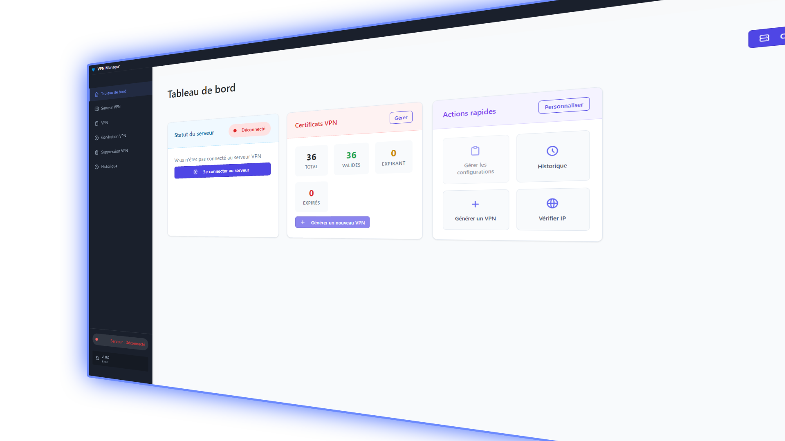
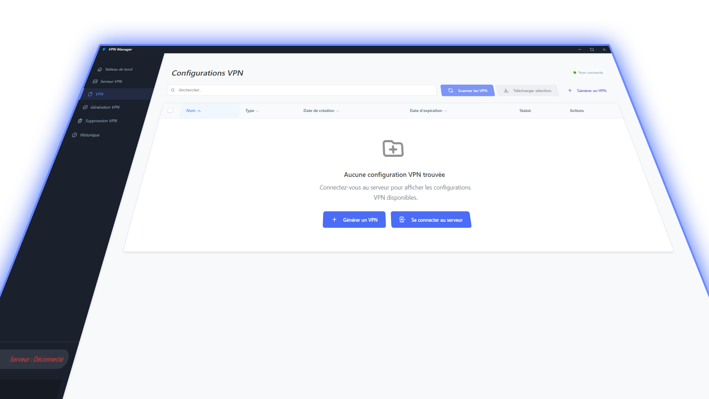

# 🚀 VPN Manager

  

## Présentation

**VPN Manager** est une application moderne et intuitive pour gérer facilement toutes tes connexions VPN depuis une interface graphique conviviale. Que tu sois soucieux de ta confidentialité 🛡️ ou que tu aies besoin d’accéder à plusieurs réseaux, VPN Manager rend la gestion des VPN simple, rapide et agréable.

---

## ✨ Fonctionnalités principales

- 🗂️ **Gestion centralisée des connexions VPN**  
  Ajoute, modifie ou supprime tes profils VPN en quelques clics.

- ⚡ **Connexion rapide**  
  Connecte-toi à tes VPN favoris instantanément grâce à une interface claire.

- 📊 **Tableau de bord en temps réel**  
  Visualise l’état de tes connexions, la bande passante utilisée et l’historique de tes activités VPN.

- 🔔 **Notifications intelligentes**  
  Reçois des alertes lors de la connexion, déconnexion ou en cas de problème réseau.

- 💻 **Support**  
  Disponible seulement sur Windows.

- 🔒 **Sécurité renforcée**  
  Toutes les informations sensibles sont stockées localement et protégées.

---

## 🖥️ Interface utilisateur

  <h3>Tableau de bord principal</h3>
  

  <h3>Gestion des VPN</h3>
  

---

## 🤔 Pourquoi choisir VPN Manager ?

- 🧑‍💻 **Simplicité d’utilisation** : Une interface pensée pour tous, même sans connaissances techniques.
- ⏱️ **Gain de temps** : Gère tous tes VPN depuis une seule application.
- 🛡️ **Sécurité** : Tes données restent privées et sous ton contrôle.
- 🧳 **Polyvalence** : Adapté aussi bien à un usage personnel que professionnel.

---

## 📦 Installation

Télécharge la dernière version [ici](https://github.com/lv-h2o/vpn-manager-updates/releases) !

